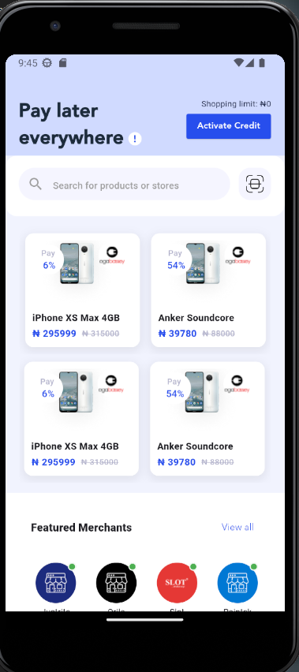
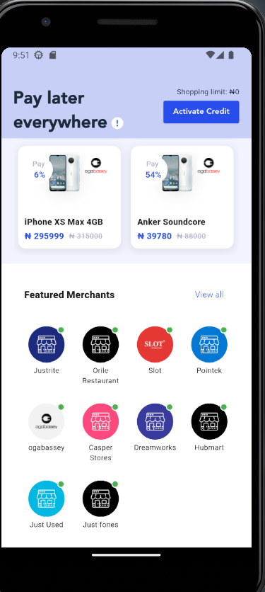
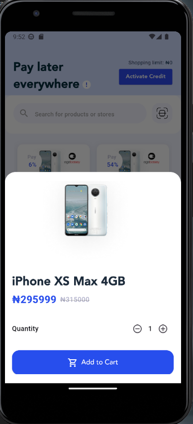
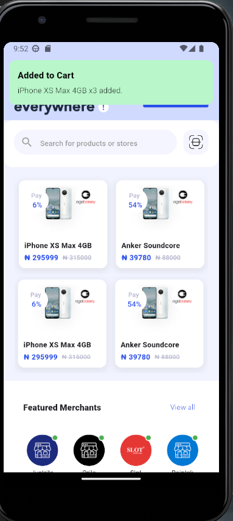
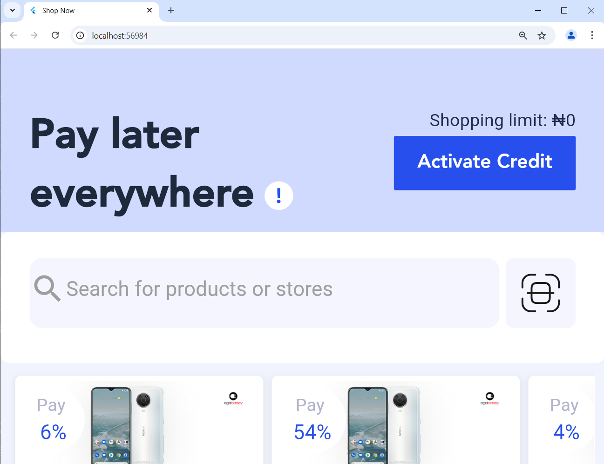
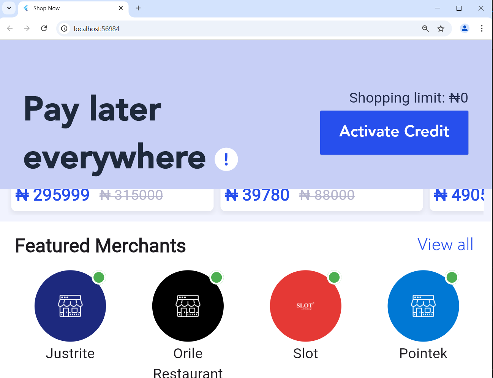

# 🛍️ shop_now – Product & Merchant Listing Page

This project showcases a Flutter implementation of a marketplace UI page with horizontal scrollable lists for both products and merchants. It includes search functionality and an animated product detail bottom sheet.

---

## 🚀 How to Run the App

### 📦 Prerequisites
- Flutter SDK (3.x recommended)
- Dart SDK
- Android Studio / VSCode (or any Flutter-supported IDE)
- Xcode (for iOS) or Chrome (for web preview)

### 🛠️ Setup Steps

1. **Clone the Repository**
   ```bash
   git clone https://github.com/yourusername/mymedicare_ui.git
   cd mymedicare_ui

2. **flutter pub get**
    - flutter pub get
    
3. **Run the App**
    : On Mobile
    - flutter run

    : On Web:
    - flutter run -d chrome


### 🧠 Assumptions & Design Decisions

## 🎨 UI Interpretation & Additions
The initial Figma/mockup design did not specify how to handle product detail views.
➤ A bottom sheet with animated Hero transition was implemented to provide a clean and smooth UX.

Products can optionally have a discount:
➤ If hasDiscount is true, both the discounted price and original price are shown. The original price is shown with a strikethrough.

Store/merchant logos are displayed at the right side of the product cards for better brand visibility and recognition.

Each merchant item has a unique background color for visual differentiation.

Product and merchant lists are horizontally scrollable and can independently scroll.

The search field supports querying both product names and store names and dynamically filters results.


## 📁 Folder Structure Overview

lib/
└── core/
    └── features/
        └── dashboard/
            ├── data/
            │   ├── controller/            # GetX Controllers (e.g., ProductController, MerchantController)
            │   └── model/                # Data Models (Product, Merchant)
            │
            └── presentation/
                ├── pages/                # Screens like HomePage
                │   └── home_page.dart
                │
                └── widgets/              # UI Components
                    ├── merchant_item.dart
                    ├── product_card.dart
                    ├── product_details_sheet.dart
                    └── widgets.dart      # Any shared or grouped widgets


 ## 🧰 Technologies Used
- Flutter

- Dart

- GetX (State Management & Navigation)

- Responsive Framework (flutter_screenutil)

## Media

# Mobile view 









# Web view



